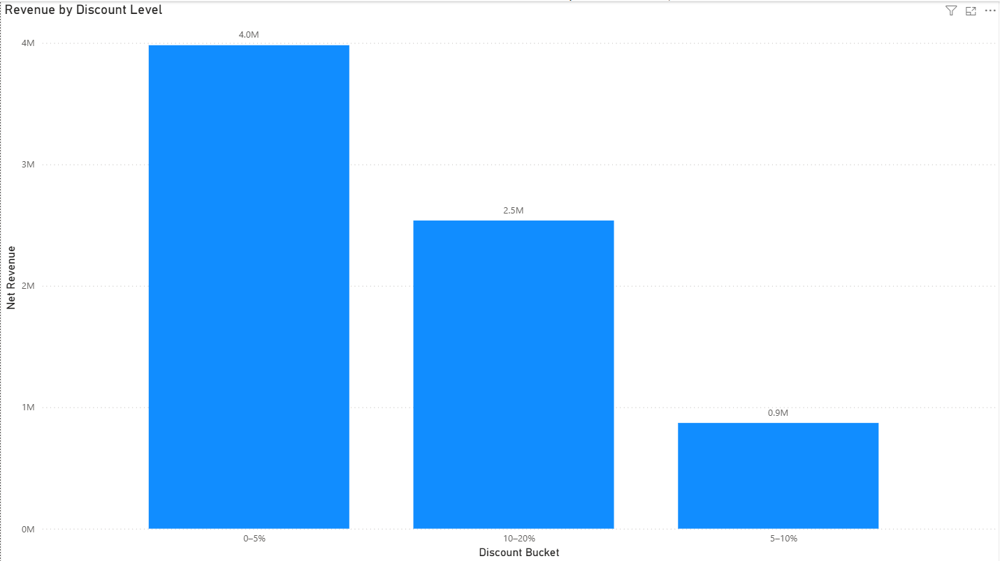
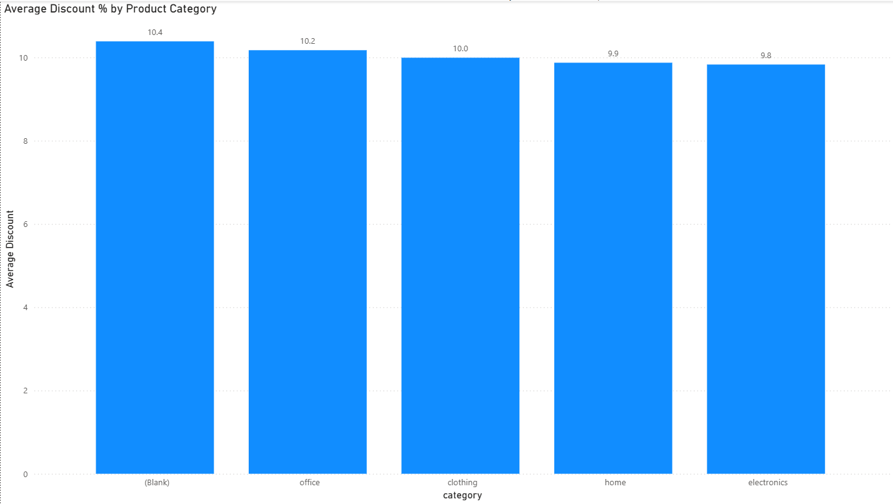
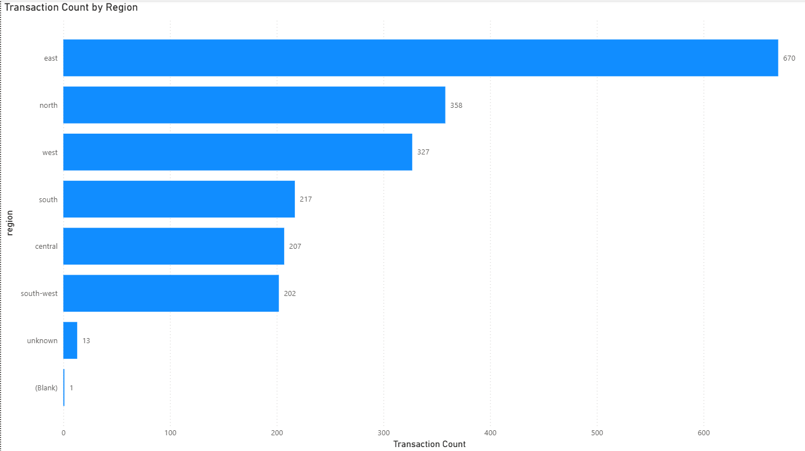
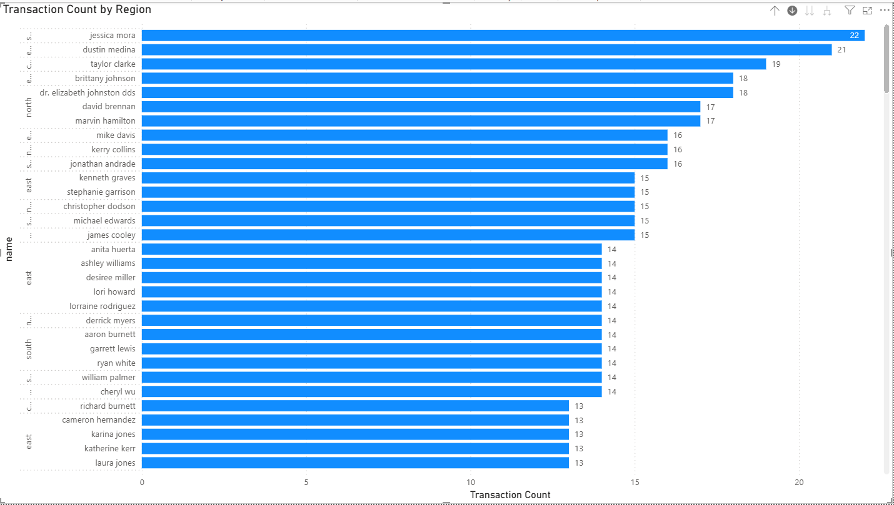
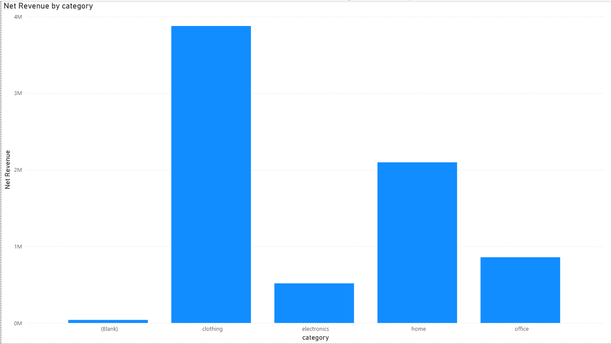
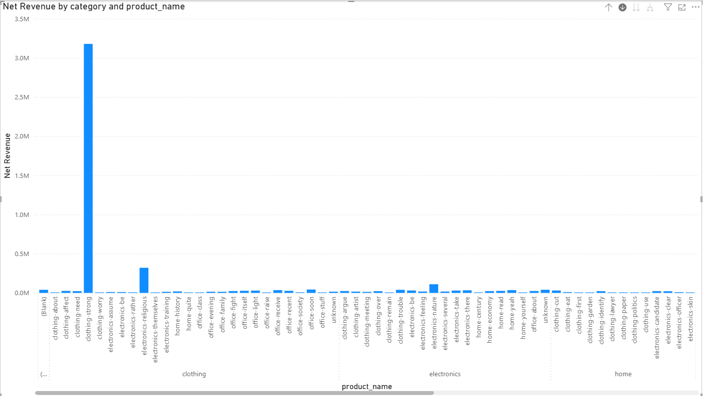

# README — Discount-adjusted Net Revenue OLAP Analysis

## Section 1. The Business Goal

**Exact question:**
Determine which product categories and customer segments drive the most **net revenue** (discount-adjusted sales) across regions and stores, and evaluate how discounting impacts net revenue.

**Why it matters:**

* Net revenue (sales after discounts) is the true short-term revenue that funds operations and margins — analyzing it shows whether discounts are increasing profitable revenue or merely inflating volume.
* Knowing which categories and customer segments produce the most net revenue enables targeted inventory, pricing, and marketing decisions (e.g., allocate stock and promotions to high-value segments and avoid deep discounts that erode profitability).
* Regional and store-level breakdowns allow operational optimization (staffing, inventory, logistics) where revenue impact is greatest.

---

## Section 2. Data Source

**Source type:** Prepared data files (cleaned exports from the project repository / database). In Power BI this data was imported from the ODBC source that contains the cleaned tables.

**Files / tables used (paths/names as in repo):**

* `data/clean/customers_cleaned.csv` — Customer dimension. Columns used:

  * `CustomerID`
  * `Name`
  * `Region`
  * `JoinDate`
  * `CustomerRewardPoints`
  * `CustomerStatus` (e.g., new, active, vip)

* `data/clean/products_cleaned.csv` — Product dimension. Columns used:

  * `ProductID`
  * `ProductName`
  * `Category`
  * `UnitPrice`
  * `ProductDiscountPercent`
  * `ProductSupplierRegion`

* `data/clean/sales_cleaned.csv` — Fact table (transactions). Columns used:

  * `TransactionID`
  * `SaleDate`
  * `CustomerID`  (FK → customers)
  * `ProductID`   (FK → products)
  * `StoreID`
  * `CampaignID`
  * `SaleAmount`  (gross revenue per transaction)
  * `DiscountPercent`
  * `SalePaymentType`

---

## Section 3. Tools

**Power BI Desktop (primary)**

* Reason: supports direct ODBC import, star-schema modeling, DAX measures for OLAP-style aggregations, hierarchical drilldowns and interactive visuals required by the assignment.

**Excel (secondary)**

* Reason: lightweight validation and quick checks of the raw CSVs prior to import.

**Why not Python in this implementation:**

* The assignment allows alternate tools; Power BI performs OLAP-style slicing/dicing and drilldown natively and produces the required deliverables (measures, visuals, documentation). No Python scripts were used.

---

## Section 4. Workflow & Logic

### Data model and joins

* Fact table: `sales_cleaned`
* Dimension tables: `customers_cleaned`, `products_cleaned`
* Relationships:

  * `sales_cleaned[CustomerID]` → `customers_cleaned[CustomerID]` (1:* )
  * `sales_cleaned[ProductID]` → `products_cleaned[ProductID]` (1:* )

### Dimensions used

* Product: `Category`, `ProductName`
* Customer: `CustomerStatus`, `Region`
* Geography: `Region`, `StoreID` (store name used for drilldown)
* Discount buckets (categorical): see below
* Payment type: `SalePaymentType`
* Campaign: `CampaignID` (optional slice)

### Aggregations / Measures (DAX)

Add these measures into the `sales_cleaned` table (copy/paste ready).

**Discount bucket (calculated column)** — *create as a column, not a measure*:

```DAX
Discount Bucket =
VAR d = sales_cleaned[DiscountPercent]
RETURN
SWITCH(
  TRUE(),
  ISBLANK(d), "Unknown",
  d <= 5, "0-5%",
  d <= 10, "5-10%",
  d <= 20, "10-20%",
  "20%+"
)
```

**Core measures**

```DAX
Total Sales = SUM( sales_cleaned[SaleAmount] )

Net Revenue =
SUMX(
  sales_cleaned,
  sales_cleaned[SaleAmount] * (1 - DIVIDE(sales_cleaned[DiscountPercent], 100))
)

Transactions = COUNT( sales_cleaned[TransactionID] )

Avg Discount = AVERAGE( sales_cleaned[DiscountPercent] )
```

### OLAP operations enacted

* **Slicing** — filter the cube by `Discount Bucket`, `Category`, `CustomerStatus`, `Region`, or `CampaignID`.
* **Dicing** — matrix-level breakdowns (e.g., `Category` × `Region`, or `Category` × `Discount Bucket`).
* **Drilldown** — hierarchies implemented:

  * `Region` → `StoreName` (transaction counts drill)
  * `Category` → `ProductName` (net revenue drill)
* **Validation** — totals sanity checks: `SUM(sales_cleaned[SaleAmount])` ≈ `Total Sales` and `Net Revenue` ≈ rowwise discounted sum.

### Visuals built (tool-specific instructions)

* Use bar/column charts and matrix visuals; enable drill mode for hierarchical fields.
* Sort `Discount Bucket` with a numeric custom order (0-5%, 5-10%, 10-20%, 20%+) for readable axes.
* Use conditional formatting on matrix heatmaps to emphasize high/low net revenue.

---

## Section 5. Results

### Visuals created (exact)

1. **Revenue by Discount Bucket** — net revenue aggregated per discount bucket (`0-5%`, `5-10%`, `10-20%`, `20%+`).
   
2. **Discount % vs Net Revenue** — illustrates relationship between discount intensity and net revenue (bucket or continuous).
   
3. **Transaction Count by Region** with drilldown to **Store Name** — shows where transaction volume is concentrated and enables store-level inspection.
   
   
4. **Revenue per Category** with drilldown to **Product Name** — highlights category leaders and the specific products that drive category revenue.
    
    

### Key insights (observed from visuals)

* **Highest net revenue** is concentrated in the **0–5%** and **10-20%** discount buckets — these buckets tend to preserve revenue while supporting sales.
* **5-10%** discounts show mixed performance: they can increase transactions for some categories but do not uniformly raise net revenue.
* **A small set of categories and products** generate the majority of net revenue.
* **Regional variation** exists: some regions/stores generate higher transaction volumes and higher net revenue; drilldown identifies a few top-performing stores.

---

## Section 6. Suggested Business Action

1. **Limit deep discounts (>=20%)** except for clearance items — they are eroding net revenue.
2. **Prefer moderate discounts (5–10%)** where appropriate: they show the best balance of volume and net revenue.
3. **Prioritize inventory and promotions for the top categories/products** identified by `Net Revenue`.
4. **Allocate marketing spend to regions/stores** that show strong net revenue per transaction; use high-performing stores as operational benchmarks.
5. **Review campaigns that drive many transactions but low net revenue** — rework them to improve margin or stop loss-making promotions.
6. **Monitor discount bucket performance by category monthly** (or after each campaign) to keep promotions data-driven.

---

## Section 7. Challenges

**No real Challenges were present within this workflow**

**How resolved**

  **All Minor Challenged were resolved with AI Problem Solving**

---

## Appendix — Quick reproduction steps

1. Import the three tables into Power BI via ODBC (or load CSVs).
2. Confirm relationships (CustomerID, ProductID).
3. Add the **Discount Bucket** column (calculated column).
4. Add the DAX measures: `Total Sales`, `Net Revenue`, `Transactions`, `Avg Discount`.
5. Build the four visuals, enable drill mode on hierarchical axes, and export visuals for submission.
6. Validate totals and save the `.pbix` file to `olap/smart_store_olap.pbix`.

---

**Prepared by:** Jackson Gentzell — OLAP / Power BI analysis of discount-adjusted net revenue.

